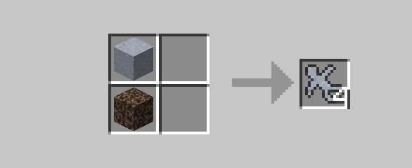
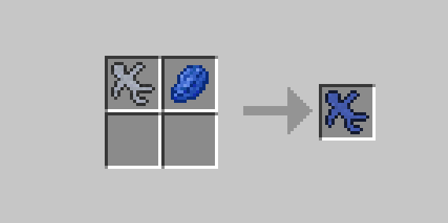
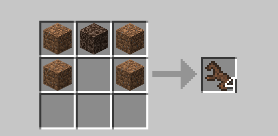
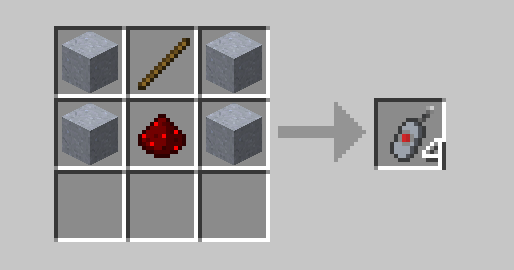

# Clay Soldiers BTA!

A port of the classic Clay Soldiers mod to Better Than Adventure! 

## Requirements
- A BTA 7.2_01+Babric instance https://github.com/Turnip-Labs/babric-instance-repo/tags
- BTA HalpLibe https://github.com/Turnip-Labs/bta-halplibe

## Recipes
   

1. Clay Soldiers
    

2. Dyed Soldiers
    

3. Dirt Horse
    

4. Clay Disruptor
    
## Tips

1. If you haven't already you should join the BTA modding discord! https://discord.gg/FTUNJhswBT
2. Clay soldiers can build houses with wooden planks!
